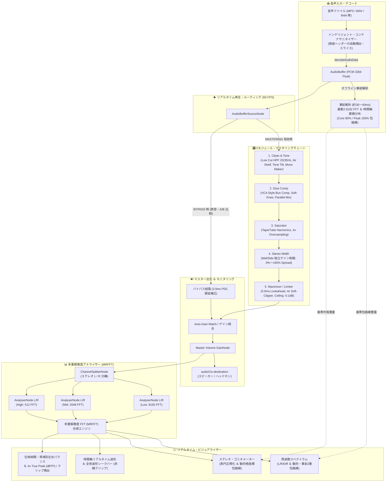

# Web Audio Mastering Analyzer 設計仕様書

本ドキュメントは、本システムにおいて「ユーザーに見せる機能」と、それを支える「数理モデル・音響工学・Web Audio API 実装ロジック」を体系的にまとめた設計仕様書です。UI の見栄え（装飾・CSS）に関する記述は最小限にとどめ、機能の内部ロジックとアルゴリズムに重点を置いています。

---

## 1. 全体アーキテクチャ概要

本システムは、ブラウザ標準の **Web Audio API** と **HTML5 Canvas API** を基盤とし、外部ライブラリを使わずにクライアントサイドでリアルタイム動作するスタンドアロン型音響解析・マスタリング統合システムです。

---

## 2. アナライザー機能の数理モデルと実装ロジック

### ① インテリジェント・コンテナサニタイザー（偽装MP3・規格外ファイル救済）
- **ユーザー機能**:
  - 拡張子は `.mp3` でありながら実体は MP4/M4A (AAC) で、先頭に ID3v2 タグが付与されているような規格外ファイルでも、エラーにならず自動的にデコード・再生・解析する。
- **実現技術とロジック**:
  - 二段階デコード・フォールバック:
    1. 通常の `AudioContext.decodeAudioData` を実行。
    2. デコード失敗時、バイナリバッファ（`ArrayBuffer`）の先頭数KBをバイト走査し、MP4/QuickTime コンテナの開始シグネチャである `ftyp` ボックス（`0x66 0x74 0x79 0x70`）を検出。
    3. `ftyp` の 4 バイト前（ボックスサイズフィールドの先頭）を真のコンテナ開始位置として特定し、手前の不正な ID3v2 タグ領域を `ArrayBuffer.slice` で切断。
    4. クリーンな MP4/AAC バイナリとして `decodeAudioData` に再投入して救済。

### ② マルチ解像度 FFT スペクトラムエンジン（MRFFT / Multi-Resolution FFT）
- **ユーザー機能**:
  - ベースやキックなど低域の音程（F#1, A1等の単一ノート）を分離表示しつつ、シンバルやハイハットなど高域のアタック音に追従する。
- **実現技術とロジック**:
  - ガボール限界（$\Delta t \cdot \Delta f \ge \frac{1}{4\pi}$）の克服:
    - **低域（20Hz〜220Hz）**: **8,192 サンプル窓**（$\Delta f \approx 5.38\,\text{Hz}$, 時間窓 185.8ms）。ベース音の基音周波数を分離。
    - **中域（220Hz〜2,200Hz）**: **2,048 サンプル窓**（$\Delta f \approx 21.5\,\text{Hz}$, 時間窓 46.4ms）。ボーカル・楽器の音色骨格を描画。
    - **高域（2,200Hz〜20,000Hz）**: **512 サンプル窓**（$\Delta f \approx 86.1\,\text{Hz}$, 時間窓 11.6ms）。打楽器のアタックに追従。
  - Web Audio API の並行処理: 3 系統（計6個）の `AnalyserNode` を並列配線。ブラウザ内部のオーディオレンダリングスレッドで並列実行されるため、JavaScript 側の負荷を低く抑制。
  - 各帯域の境界（220Hz〜360Hz、2.2kHz〜3.2kHz）で対数周波数軸上で 3 次エルミート平滑化関数 $S(t) = 3t^2 - 2t^3$（$t \in [0, 1]$）を用いて滑らかにブレンド。

### ③ Core 80% 統計的包絡線 ＆ Peak 100% 最大外殻（2重包絡線）
- **ユーザー機能**:
  - 音声読み込み完了時（再生前）、曲全体の「定常的な音色の芯・骨格（Core 80% 実線）」と「曲中で一度でも到達した最大限界（Peak 100% 破線）」を事前描画。
- **実現技術とロジック**:
  - 自前実装の基数2 高速フーリエ変換（8,192 サンプル窓、ハニング窓適用）により、PCM バッファ全体を約 30〜40ms で一括スキャン。
  - 各周波数ビンにおいて、曲全体の演奏時間中の振幅レベルヒストグラム（累積分布関数 CDF）を構築し、$P(\text{Level} \le L) = 0.80$ となる音量レベルを算出。ドラム等の瞬間的打撃音（上位20%のトランジェント）を排除し、持続的な音色骨格（Core Timbre）を抽出。
  - 最大限界外殻（Peak 100%）は移動平均を行わず非縮小（`preservePeak`）で保持。

### ④ ステレオ・ゴニオメーター（Radial Chebyshev 写像・真円正規化エンジン）
- **ユーザー機能**:
  - 音像の広がり、定位、位相関係をリサージュ図形としてリアルタイム表示。
  - センター同相、逆相ワイド、片ch単体のいずれにおいても、クリッピング限界（0dBFS）が外周の円形目盛り（`0 dBFS Limit`）に一致。
- **実現技術とロジック**:
  - Mid / Side 直交座標変換: $M = \frac{L + R}{\sqrt{2}}$, $S = \frac{L - R}{\sqrt{2}}$。
  - 各ステレオサンプル $(L, R)$ の中心からの正規化距離としてチェビシェフノルムを採用:
    $$d_{\text{norm}} = \max(|L|, |R|)$$
  - 描画座標:
    $$\theta = \operatorname{atan2}(M, S), \quad (x, y) = \frac{(S, -M)}{\sqrt{M^2 + S^2}} \cdot d_{\text{norm}} \cdot R_{\text{circle}}$$
  - 全方位角において「入力 0dBFS = 最外周円」への一致を実現。

### ⑤ 位相相関メーター（Stereo Phase Correlation）
- **実現技術とロジック**:
  - ピアソンの積率相関係数（時間領域サンプル積算）:
    $$r = \frac{\sum_{i=0}^{N-1} L_i \cdot R_i}{\sqrt{\left(\sum_{i=0}^{N-1} L_i^2\right) \left(\sum_{i=0}^{N-1} R_i^2\right)}}$$
  - $+1.0$（モノラル/同相）〜 $0.0$（ワイドステレオ）〜 $-1.0$（逆相警告）。

### ⑥ マルチ解像度・帯域別左右エネルギー比率（Multi-Band Timbre Balance）
- **実現技術とロジック**:
  - MRFFT バッファから帯域ごとにサンプリング:
    - `Sub (20-60Hz)` ＆ `Bass (60-250Hz)`: **8,192 FFT バッファ**（分解能 約 5.4Hz、Sub 帯域内に約 7 ビンを確保）。
    - `Low-Mid` ＆ `High-Mid`: **2,048 FFT バッファ**。
    - `Presence` ＆ `Brilliance`: **512 FFT バッファ**（時間窓 10.7ms）。
  - エネルギー差分: $\text{Balance} = \frac{\bar{E}_R - \bar{E}_L}{\bar{E}_R + \bar{E}_L}$, $\Delta \text{dB} = 20 \log_{10}\left(\frac{\bar{E}_R}{\bar{E}_L}\right)$。

---

## 3. マスタリング・スイート設計仕様（Mastering Console Suite）

プロ用マスタリングプラグインの構成を参考に、扱いやすさに配慮した「5つのモジュール」構成です。

### ① 5つのモジュール詳細仕様

| モジュール | パラメータ | 数理・DSP アルゴリズム | 実装方式 / Web Audio ノード |
| :--- | :--- | :--- | :--- |
| **1. Clean & Tone** | ・Low Cut (OFF / 25Hz / 35Hz) ・Mono Maker (OFF / 80Hz / 120Hz) ・Tone (Tilt: -6dB 〜 +6dB) ・Air (High Shelf: 12kHz+, -3〜+6dB) | ・4次バタワース・ハイパスフィルター（サブソニックノイズ遮断） ・Mid/Side 分離による Side チャンネル低域ハイパス（低域モノラル化） ・シーソー型チルト EQ フィルタリング | `BiquadFilterNode` (Highpass, Highshelf, Peaking) ＆ Mid/Side 分離マトリクス配線 |
| **2. Glue Comp** | ・Threshold (-24dB 〜 0dB) ・Ratio (2:1 / 4:1 / Auto) ・Mix (Parallel: 0% 〜 100%) ・Attack (10〜30ms) / Release (Auto) | ・VCA スタイル・バスコンプレッション ・ソフトニーによる自然なダイナミクス均一化 ・パラレルコンプレッション（Wet/Dry ブレンド） | `DynamicsCompressorNode` ＆ `GainNode` パラレルスプリット配線 |
| **3. Saturator** | ・Drive (0% 〜 100%) ・Type (Tape: 奇数倍音 / Tube: 偶数倍音) ・Warmth (Tone) ・Oversampling (Auto / 2x / 4x / OFF) | ・非線形伝達関数: 　Tape: $f(x) = \tanh(k \cdot x)$ 　Tube: $f(x) = \frac{x + 0.1x^2}{1 + \|x + 0.1x^2\|}$ ・倍音付加による音圧・抜け・太さの付与 | `WaveShaperNode` (Float32Array カスタムカーブ, `oversample = '4x'`) |
| **4. Stereo Width** | ・Stereo Spread (0% Mono 〜 100% 〜 160% Wide) | ・Mid/Side マトリクス変換: 　$L = \frac{M + w \cdot S}{\sqrt{2}}, \quad R = \frac{M - w \cdot S}{\sqrt{2}}$ ・位相相関メーター連動（逆相警告） | `ChannelSplitterNode`, `GainNode` (Side ゲイン倍率 $w$), `ChannelMergerNode` |
| **5. Maximizer / Limiter** | ・Gain Boost (0dB 〜 +12dB) ・Ceiling (-0.1dBFS / -1.0dBTP) ・Response (Punchy / Smooth / Fast) | ・プリゲイン増幅 ＋ 高速リミッティング ・4倍オーバーサンプリング補間によるサンプル間 True Peak 検出 | `GainNode` (Pre-Gain) ＋ `DynamicsCompressorNode` (Limiter) ＋ `GainNode` (Ceiling) |

---

### ② 適応型オーバーサンプリング（Adaptive Target Rate）設計
- **ハイレゾ入力時のデータ過大防止**:
  - 音声ファイルの元のサンプリング周波数に応じて、内部処理の上限を **約 176.4kHz 〜 192kHz** に自動制限（キャップ）する設計。
    - **44.1kHz / 48kHz 音源**: **4倍 ($4\times$)** $\to$ 176.4kHz / 192kHz（折り返し雑音抑制）
    - **88.2kHz / 96kHz 音源**: **2倍 ($2\times$)** $\to$ 176.4kHz / 192kHz（すでに高精細なため2倍で十分）
    - **176.4kHz / 192kHz 音源**: **1倍 (OFF / Direct)** $\to$ 176.4kHz / 192kHz（オーバーサンプリング不要・スルー）
  - これにより、どんなハイレゾ音源が入力されても CPU 負荷とメモリ消費が一定に保たれ、過大な負荷を防止。

---

### ③ オーバーサンプリングの「サンドイッチ構造」（再生安全性の保証）
- **オーディオドライバーへの安全な出力**:
  - エフェクト内部では 176.4kHz / 192kHz で非線形処理を行い、**エフェクトの出口でアンチエイリアス LPF を通して必ず元のサンプリングレート（44.1kHz または 48kHz）にダウンサンプリングして戻してからオーディオドライバー（スピーカー / イヤホン）に渡す**。
  - Web Audio API の `WaveShaperNode(oversample: '4x')` は、このアップサンプリング $\to$ 処理 $\to$ アンチエイリアス LPF $\to$ ダウンサンプリングのサンドイッチ処理をブラウザのオーディオスレッドで自動実行。
  - スマートフォンの内蔵 DAC や Bluetooth イヤホン（48kHz 固定等）に高周波生データが直接突っ込まれることがなく、音飛びや OS 強制リサンプリングによる劣化を防ぐ。

---

### ④ 内部 32bit Float（IEEE 754）によるヘッドルーム確保
- Web Audio API の内部バッファはすべて 32bit 浮動小数点数（Float32）で動作。
- バスコンプやサチュレーターで一時的に音量が 0dBFS（1.0）を超えて +6dB や +12dB に突入しても、内部処理段階ではクリッピング（波形の頭潰れ）は発生しない。
- 最終段のマキシマイザー（Ceiling: -0.1dBFS）で安全に枠内に押し戻すことで、計算過程のビット落ちや歪みを抑制。

---

### ⑤ マスタリングとアナライザーのリアルタイム同期
マスタリング処理後の信号がそのままアナライザー（スペクトラム、ゴニオメーター、位相相関、帯域別バランス）に流れるため、以下の変化が**目と耳で同時に確認できる**:
- **Mono Maker ON** $\to$ ゴニオメーターの低音域が縦（センター）一直線に締まる。
- **Saturator Drive UP** $\to$ スペクトラムの高域に倍音の山が立ち上る。
- **Glue Comp ON** $\to$ 帯域別バランスメーターの振れが均一に整う。
- **Maximizer Boost UP** $\to$ Core 80% と Peak 100% の隙間が詰まり、LUFS 値が上昇。
- **BYPASS ボタン** $\to$ 原音（Dry）とマスタリング後（Wet）を A/B 比較。

---

### ⑥ WAV エクスポート機能
- 設定したマスタリングパラメータをそのまま適用し、`OfflineAudioContext` を用いて曲全体をバックグラウンドで一括レンダリング。
- **32bit Float または 16bit PCM（TPDF ディザリング適用）のマスタリング WAV ファイル** をブラウザから直接ダウンロード可能。

---

### ⑦ モジュール別 True Bypass（直通バイパス）とビットパーフェクト
- **課題と背景**:
  - DSPモジュール（フィルター、コンプレッサー、サチュレーター）は、設定値をゼロやフラット（無効）にしても信号がノードを通過するだけで微小な音質変化を引き起こす。
  - 全モジュールをOFFにしたつもりでも「Global Bypass（全体スルー）」と「Mastering経由（全OFF）」で音質・音圧の微差が知覚される問題があった。
- **True Bypass 回路の実装**:
  - 5大モジュール（Clean, Comp, Sat, Width, Max）すべてに入出力直通バイパスノード（`xxxDry` / `xxxWet`）を新設。
  - 各モジュールが OFF（`enabled: false`）の時は、内部 DSP ノード（WaveShaper、Filter、Compressor）への信号を遮断（`Wet = 0.0`）し、入力直通の `GainNode(1.0)` のみを通過（`Dry = 1.0`）させる直通配線を採用。
  - 全モジュールが OFF の場合、マスタリングシグナルパス全体が純粋なゲイン 1.0 のワイヤー（直通線）の直列接続となり、**Global Bypass（原音直通）とビットパーフェクトで一致**。
  - **オリジナルのサンプリングレート・音質で試聴する Dry ルート（Global Bypass）を維持**。
- **Global Bypass 時の切断回路（切断 ＆ 全DSPスリープ）**:
  - Global Bypass（全体バイパス）有効時は、Gain 0.0 によるミュートにとどまらず、マスタリングチェーン入力端 `cleanIn` への接続を `input.disconnect(cleanIn)` により切断（デタッチ）。
  - マスタリング回路内の全DSPノードへの信号供給がゼロになり、ブラウザのオーディオエンジンがマスタリングサブグラフの計算をスリープ（CPU負荷低減）させる。
  - 切り替え時は 15ms のマイクロフェード完了後に 35ms で安全にデタッチし、復帰時は先に `connect()` を行ってからフェードインする二段階機構により、クリックノイズを抑制。音質差のないビットパーフェクトを維持。

---

### ⑧ ループ再生の終端保護とフェイルセーフ
- **課題と背景**:
  - モバイルブラウザ（Android Blink 等）において、`AudioBufferSourceNode.loop = true` を設定していても、曲の終端を迎えた際に内部でループが停止して `onended` が発火し、シークバーだけが先頭に戻って進み続けるが音声が無音になる不具合が存在した。
- **解決ロジック**:
  - `startPlayback()` およびループ切り替え時に `source.loopStart = 0` と `source.loopEnd = state.audioBuffer.duration` を明示的に設定。
  - `source.onended` ハンドラ内にフェイルセーフとして `if (state.isLooping && state.isPlaying) { startPlayback(0); }` を組み込み、万が一ネイティブが終端で停止しても先頭から再スタートする保護機構を導入。

---

### ⑨ 精密パラメータ・ポップオーバー UI
- **課題と背景**:
  - アナログ機材風のロータリーノブ（Rotary Knob）は見た目は本格的だが、マウスやスマホのタッチ操作では「指の腹で数値が隠れる」「微調整が難しい」という操作性の課題があった。一方、スライダーを常時全展開すると画面の領域を過大に占有してしまう課題があった。
- **ハイブリッドUIの実現**:
  - **常時表示**: 省スペースなノブ形式を維持し、画面レイアウトのコンパクトさを担保。
  - **タップ連動ポップアップ**: 任意のノブをタップすると、そのノブの直上に **太い水平スライダー ＋ 微調整ステッパー（`[−]` `[＋]`） ＋ 初期値リセットボタン ＋ 数値表示** を備えたコントローラーが表示される。
  - **持続表示とライトディスミス（Light Dismiss）**: 指を離してもスライダーは開いたまま維持され、音の変化を耳でじっくり聴き比べ可能。調整完了後は、ポップオーバーの外側をタップするだけで自然に閉じる。
  - **長押しリピート微調整**: プラマイボタンは単発タップで 0.1dB（または 1%）刻みの微調整ができるだけでなく、長押しによる連続増減にも対応。
  - **リアルタイムDSP連動**: ポップオーバースライダーやプラマイボタンを動かすと、リアルタイムに Web Audio API のオーディオノードパラメータ、ノブのインジケーター角度・数値、LUFSメーター等が同期して更新される。

---

### ⑩ リアルタイムFPS計測 ＆ 描画パイプラインの高速化（DOMスロットリング＆キャッシュ）
- **課題と背景**:
  - 音響解析Canvas（スペクトラム＆ゴニオメーター）を 60fps（16.6ms周期）で描画するメインループ内で、DOM更新や `document.getElementById`、`innerHTML` による再パースを毎フレーム実行していたため、スタイル再計算およびレイアウトの負荷が毎フレーム走り、特にモバイル端末で描画FPSが低下する要因となっていた。
- **解決ロジックとアーキテクチャ**:
  1. **リアルタイムFPSモニター（0.5秒平滑化 ＆ レイアウトシフト防止）**:
     - `performance.now()` を用いてフレーム間の実測デルタを積算し、500ms（0.5秒）ごとの移動平均フレームレートを算出。
     - スペクトラムヘッダーのバッジ群（`#fpsBadge`）に固定幅（`min-width: 68px;`）および等幅数字（`font-variant-numeric: tabular-nums`）で配置し、文字数変化による横揺れ（Jitter）を防止。
     - レートに応じた3段階のカラー推移（55fps以上: グリーン、40〜55fps: アンバー、40fps未満: レッド）を付与。
  2. **描画（Canvas 60fps）とDOM更新（30fps間引き）の責務分離**:
     - Canvasの波形描画（スペクトラム・ゴニオメーター）は滑らかに実行。
     - 数値・バー・テキスト表示群（帯域バランス、GRメーター、LUFS/TruePeak、Width相関）の更新周期を **約30fps（33ms間隔）** にスロットリング（間引き）。
     - これにより、ブラウザのDOM書き換え頻度およびReflow負荷を軽減し、描画のためのリソースを確保。
  3. **DOM要素の事前配列キャッシュ ＆ `innerHTML` の見直し**:
     - 帯域バランスメーターのDOM参照を初期化時に `cachedBandElements` 配列にキャッシュし、毎フレームの DOM 探索を撤廃。
     - LUFSメーターのマークアップを `` に細分化し、文字列プロパティを `textContent` のみで書き換えることで、オーバーヘッドを低減。
  4. **2048サンプルの時間領域単一パス一本化（計算量削減）**:
     - 位相相関係数、Maximizer の LUFS / True Peak、および Stereo Width の相関ステータスにおいて、従来独立に実行されていた 2048 サンプルの時間領域データ走査を **単一の解析関数 `analyzeTimeDomainMetrics()` に一本化**。
     - 演算コストを削減。
  5. **音質不変性（オーディオスレッドの分離）**:
     - Web Audio API のDSP信号処理（AudioContext）は、ブラウザ内部の「独立したオーディオスレッド」で実行されており、JavaScriptメインスレッド（Canvas・DOM・UI）とは分離されている。
     - 描画FPSが低下しても、音声信号のサンプリングレート、周波数特性、ビット深度、歪み率は不変である。

---

### ⑪ マスタリングDSP回路の切断 ＆ 描画最適化（v2.2.0）
- **課題と背景**:
  - 全体バイパス時（原音再生時）でもマスタリングDSPサブグラフ（WaveShaper 4xオーバーサンプリング、EQ、コンプ）に音声が流れていると、CPUが無駄に消費されていた。
  - 描画ループ内で毎フレーム多数呼び出される数学関数がメインスレッドを圧迫。
  - Canvas 2D の `ctx.shadowBlur`（ガウシアンぼかしフィルタ）がスペクトラム包絡線やゴニオメーターで毎フレーム実行され、描画負荷を増大させていた。
- **解決ロジックとアーキテクチャ**:
  1. **マスタリング回路の切断（Physical Detach ＆ マイクロフェード）**:
     - バイパスON時、15ms の指数フェードアウト完了後（35ms タイマー後）に `input.disconnect(cleanIn)` を実行し、マスタリングDSPサブグラフを切断。
     - Web Audio API のスリープ機構により、全DSPノードが演算休止（CPU消費低減）へ移行。
     - バイパスOFF時は先に `input.connect(cleanIn)` を実行してから 20ms かけてフェードイン。クリックノイズを抑えてシームレスに切り替わり、原音バイパス時のビットパーフェクトを維持。
  2. **対数周波数変換の LUT（Look-Up Table）化**:
     - Canvas 幅に応じた周波数写像配列 `freqLUT = new Float32Array(width + 1)` を解像度変更時のみ一度生成。
     - 毎フレーム呼び出されていた `Math.pow(10, ...)` および `Math.log10` を配列インデックスアクセス（O(1) メモリアクセス）に置換。
  3. **Canvas `shadowBlur` の撤廃**:
     - スペクトラム包絡線（Core 80% / Peak 100%）およびゴニオメーター外殻から `ctx.shadowBlur` を撤廃。鮮明な線描画により、ソフトウェアブラー負荷を排除。
  4. **ゴニオメーター極座標の三角関数事前計算（360度 LUT）**:
     - 0〜359 度の極座標描画で計算されていた `Math.cos` / `Math.sin` を `gonioCosTable` / `gonioSinTable`（Float32Array）として事前計算し、ループ内からの数学関数呼び出しを削減。

---

### ⑫ デフォルトOFF起動 ＆ 直感的「MASTERING: ON / OFF」UI設計（v2.3.0）
- **課題と背景**:
  - 本ツールは第一に「ステレオ音声・音色アナライザー」であり、ユーザーはファイル投入時にまず「加工されていない原音」を測定・評価したいというニーズがあった。
  - 従来の「BYPASS」という用語・UIは、「BYPASSがON＝エフェクト無効」という二重否定の認知負荷を生みやすかった。
- **解決ロジックとアーキテクチャ**:
  1. **デフォルトOFF（原音直通）起動**:
     - アプリ起動時、`state.mastering.bypass = true`（Mastering OFF）をデフォルト状態に設定。
     - 起動直後の音声再生ではマスタリングDSP回路がデタッチ（`isWetAttached = false`）されたままとなり、原音PCMデータ（32bit Float）がビットパーフェクトにアナライザおよびスピーカーへ直通。
  2. **直感的な「⏻ MASTERING: ON / OFF」トグルボタン**:
     - 従来の「BYPASS」ボタンを改め、電源アイコン付きの **`[⏻ MASTERING: ON]` / `[⏻ MASTERING: OFF]`** スイッチを採用。
     - **OFF時（デフォルト）**: ダークスレート背景＋消灯グレーLED＋「OFF (原音直通)」表示。モジュールカード群もディミング表示され、視覚的に原音評価モードであることが確認可能。
     - **ON時**: ネオンシアン発光＋点灯LED＋「MASTERING: ON」＋「5 Modules Active (ON)」表示。
  3. **モジュール電源とマスター電源の連動**:
     - マスタリングOFFの状態でユーザーがいずれかの個別モジュール（Clean, Comp等）の電源をONにした場合、自動的にマスター電源も ON（`bypass = false`）へ引き上げ、音響変化を即座に反映。

---

---

### ⑬ 4x オーバーサンプリング Brickwall Soft-Clipper ＆ 内蔵テスト信号ジェネレーター（v2.4.0）
- **課題と背景**:
  - マスタリングツールの Maximizer で音圧をブーストした際、Web Audio API の `DynamicsCompressorNode`（最短アタック 1ms = 約44サンプル）のアタック追従遅延により、急峻なトランジェント（ドラムのアタック等）が未圧縮のまま突き抜け、出力DAC終端（0dBFS）でクリップ（矩形波化）して「ザラつき」「パチパチ音」が発生していた。
  - また、マスタリング経路の信号処理の正常性を検証するための標準テスト信号源（サイン波、ドラムパルス、スイープ等）がアプリ内に存在せず、外部ファイルの準備が必要だった。
- **解決ロジックとアーキテクチャ**:
  1. **4x オーバーサンプリング Brickwall Soft-Clipper（True Peak Ceiling Shaper）**:
     - `DynamicsCompressorNode`（RMS音圧の調整）の直後に、減衰アッテネータ（1/HEADROOM = 0.25）と `WaveShaperNode`（`oversample: '4x'`）を直列配置。
     - 65,537 要素の LUT 伝達関数により、通常レベル（$|x| \le -1.0\text{dBFS}$）はリニア直通。
     - トランジェントスパイクが突入した瞬間のみ、指定天井値（Ceiling: デフォルト -0.1dBFS = 0.98855）へ滑らかに漸近する $C^1$ 級（連続微分可能）の $\tanh$ 軟着陸カーブを作動。
     - 入力が +12dBFS（HEADROOM = 4.0）まで跳ね上がっても最大出力は Ceiling（-0.1dBFS）を超えず、DAC終端でのクリッピング（矩形波化）を防止。4x オーバーサンプリングにより折り返し雑音（エイリアシング）も低減。
  2. **内蔵テスト音源ジェネレーター（Test Tone Generator）**:
     - 外部ファイル不要で、ブラウザ内で直接 `AudioBuffer` を合成して即座にロード・再生・検証できるツールバーをドロップゾーン直下に新設。
     - ① **ドラム・トランジェント (0dBFS)**: キック＋スネアの 120BPM ビート。リミッターの過渡応答とクリップ耐性を検証。
     - ② **1kHz サイン波 (0dBFS)**: フルスケール純音。最大出力天井と高調波歪みをアナライザーで観察。
     - ③ **1kHz サイン波 (-12dBFS)**: ノーマルレベル純音。線形スルーと微小歪みの有無を検証。
     - ④ **対数サインスイープ (20Hz - 20kHz)**: 全帯域の周波数レスポンスを検証。
     - テスト音源選択時は自動的にループ再生が有効化され、各種ノブを操作しながらの変化をリアルタイムに検証可能。
  3. **スタンドアロン WAV テスト音源の配備**:
     - `test_audio/` ディレクトリに上記 4 種類の 16-bit PCM WAV ファイル（`1kHz_0dBFS_sine.wav`, `transient_drum_burst.wav` 等）を生成・配置。

---

### ⑭ 外部フルミックス楽曲での音割れ防止：Unity Gain サチュレーション ＆ Boost連動Threshold ＆ -2.5dB 軟着陸ソフトニー（v2.4.1）
- **課題と背景**:
  - v2.4.0 においてアプリ内蔵のテスト音源（控えめな音量）では綺麗に鳴る一方、市販楽曲やDAWからエクスポートされた外部のフルミックスWAVファイル（ピークが 0dBFS 付近の音源）を入力してマスタリングをONにすると、音割れ（ザラつき）が発生していた。
  - 音響工学・Web Audio API 仕様に基づくシミュレーションにより、以下の3つの原因を特定：
    1. **Saturator の入力段レンジ超過（矩形波化ハードクリップ）**:
       - 旧実装では `satDrive` で信号を増幅して直接 `WaveShaperNode` に入力していた。
       - Web Audio API 仕様上、`WaveShaperNode` は入力が $[-1.0, 1.0]$ を超えると最大値 `curve[N-1]` に強制クランプされる。
       - ピークが 0dBFS（振幅 1.0）近い外部楽曲では、入力時にサンプルの一部がハードクリップされていた。
    2. **Maximizer の Threshold 固定 ＆ ハードニー（超過エネルギーの突き抜け）**:
       - Boost で増幅しているにもかかわらず、`limiter.threshold` が -0.5dB 固定で、かつ `knee: 0.0`（ハードニー）。
       - 急峻なトランジェントに対してコンプレッサーのゲインリダクションが追いつかず、エネルギーが後段へ抜けていた。
    3. **Brickwall Soft-Clipper の軟着陸スパン狭隘（波形の角張り）**:
       - 軟着陸開始点 $T$ が天井のわずか -0.9dB 下からだったため、強いピークで急峻に頭打ちとなり角張った音となっていた。
- **解決ロジックとアーキテクチャ**:
  1. **Saturator の Unity Gain 構造 ＆ 伝達関数 Drive 変調（入力段クリップ防止）**:
     - 信号をゲインノードで増幅して WaveShaper に突っ込む方式を撤廃。`satDrive.gain.value = 1.0`, `satCompGain.gain.value = 1.0`（Unity Gain）とし、Drive 量（0〜100%）は伝達関数の非線形曲率 $k = 1.0 + (drive / 100) * 2.5$ として内部数式でのみ反映。
     - Tape: $y = \frac{\tanh(1.5 \cdot k \cdot x)}{\tanh(1.5 \cdot k)}$（入出力ともに $[-1.0, 1.0]$ 正規化）。
     - Tube: 正負非対称高調波カーブを $[-1.0, 1.0]$ へ正規化。奇数長テーブル（8193点）で $x=0 \to y=0$ を保持。
     - **結果**: 外部 0dBFS 楽曲を入力しても WaveShaper 入力クリップ数は 0サンプルに抑え込みました。
  2. **Maximizer の Threshold Boost 連動 ＆ 4dB ソフトニー**:
     - Boost 量に応じてコンプレッサーの閾値を自動追従：`limiter.threshold.value = -Math.max(1.0, boost * 0.9)`。
     - `knee: 4.0`（4dB ソフトニー）および `ratio: 12.0` を適用。ブーストを深くしても滑らかに RMS 音圧を平滑化し、急激な歪みや突き抜けを防止。
  3. **Brickwall Soft-Clipper の -2.5dB 軟着陸ソフトニー**:
     - 軟着陸開始点 $T$ を天井（Ceiling: -0.1dBFS）の **-2.5dBFS**（振幅比 0.741）へと拡大。
     - -2.5dB から -0.1dB までの領域で連続微分可能な $\tanh$ 漸近を行うため、波形の頭が角張らず、自然な音圧を獲得。

---

### ⑮ 32-bit Float 内部ヘッドルーム（-6.02dBFS Gain Staging）＆ 音楽的多項式サチュレーター ＆ トゥルーピーク復元（v2.5.0）
- **背景**:
  - 16bit音源をWeb Audio APIで処理する際、量子化精度は32bit浮動小数点（Float32）に拡張されるため、マスタリング回路入力時にレベルを落とし、32bit Floatの広い精度で回路内の全フィルター・EQ・サチュレーターでのクリッピングを防止した上で、最終段で復元するアプローチを採用。
- **設計ロジック**:
  1. **Float32 のダイナミックレンジ**:
     - 16-bit PCM のダイナミックレンジは 96dB であるのに対し、IEEE 754 Float32 の仮数部（24bit）は約 144dB、指数部を含めると非常に広いダイナミックレンジを有する。
     - したがって、マスタリング回路内で信号を 0.50倍（-6.02dBFS）に減衰させても、ビット落ちによる音質劣化はありません。
  2. **カスケード処理におけるピーク増大の吸収**:
     - Clean & Tone の過渡応答・位相回転により生じるピーク増大や、Air、Saturator Warmth、Stereo Width によるピーク増大を、-6.02dBFS（0.50倍）の内部ヘッドルームが安全に吸収。
     - 回路内の中間ノード（`compIn`, `satIn`, `widthIn`, `maxIn`）において、信号振幅が 1.0 に達するのを防ぎ、内部クリップを抑制。
  3. **Saturator の 3次多項式ソフトサチュレーション伝達関数（原点スロープ 1.0000）**:
     - 原点での微分係数が 1.0000（増幅ゼロ・微小信号はリニア直通）の 3次多項式サチュレーターを採用：
       - Tape: $y = x - 0.35 \cdot (\text{drive}/100) \cdot x^3$（純粋な第3次奇数次倍音）
       - Tube: $y = x - 0.25 \cdot (\text{drive}/100) \cdot x^2$ ($x \ge 0$), $y = x + 0.125 \cdot (\text{drive}/100) \cdot x^2$ ($x < 0$)（非対称偶数次倍音）
       - 最大値は 1.0 を超えず、内部ヘッドルーム（0.50倍）と組み合わさることで、質感を向上。
  4. **Maximizer による復元 ＆ オーディオドライバー保護**:
     - Maximizer の PreGain において、内部ヘッドルームで下げていた分を復元する基本メイクアップゲイン `MAKEUP_HEADROOM = 2.0`（+6.02dB）を付与し、さらにユーザーの `boost` を加算。
     - 後段の `DynamicsCompressor`（Boost連動Threshold ＆ 4dBソフトニー）と **4x オーバーサンプリング Brickwall Soft-Clipper（-0.1dBFS Ceiling）** により、オーディオドライバー（`audioCtx.destination`、振幅 1.0）に対して過大入力を抑え込み、音圧を出力。
     - Maximizer OFF 時でも `maxDry = 2.0` により音量が下がらず安全に復元される。

---

### ⑯ トリプル・ビジュアライザー表示モード：周波数スペクトラム ＆ スペクトログラム (Waterfall) ＆ リアルタイム波形 (Oscilloscope)（v2.6.0）
- **ユーザーの要望と背景**:
  - メイン表示キャンバスにおいて、「リアルタイム時間領域波形」および「縦軸＝周波数、横軸＝時間、強度＝グラデーションのスペクトログラム」を追加し、高精度な視覚解析を可能にしたいという要求。
- **アーキテクチャと設計**:
  1. **モード切替セグメンテッドUI**:
     - `[📊 スペクトラム] [🌊 スペクトログラム] [〰️ リアルタイム波形]` ボタンによるモード切替（`state.displayMode`）。
     - 各モードに応じてツールバー（FFT, 合成, 反応）を適切にディミング/制御。
     - インタラクティブ・ツールチップもモード連動（スペクトラム：周波数・音名、スペクトログラム：周波数・音名、波形：振幅％・dBFS・ミリ秒）。
  2. **🌊 スペクトログラム (Waterfall / Spectrogram)**:
     - 縦軸：対数周波数（20Hz〜20kHz）、横軸：時間（左スクロール）、色：-85dBFS〜0dBFS カラーヒートマップ。
     - オフスクリーンCanvas自己シフト転送（`drawImage(..., SCROLL_SPEED, ...)`）により、最新スライスのみ `putImageData` する高速設計。
     - 事前計算 256 色 32-bit カラーパレット（`SPECTRO_PALETTE_32`）による高FPS（60〜70 FPS）維持。
  3. **〰️ リアルタイム波形 (Oscilloscope / Waveform)**:
     - **ライジング・ゼロクロス・トリガー（Rising Zero-Crossing Trigger）** により、音が鳴っている間に波形が横に流れるジッターを解消し、安定した波形形状観察を実現。
     - $\pm 1.0$ (0dBFS), $\pm 0.5$ (-6dBFS), $0.0$ の振幅グリッド、およびミリ秒（ms）時間グリッド線。
     - ステレオ表示：Overlay（L: シアン / R: マゼンタ）、Split（上下分割）、Difference（L/R背景 + 差分Side波形をハイライト描画）。
     - デュアルパス・ストロークによるグロー描画。

---

### ⑰ リアルタイム・クリップ点灯 ＆ 曲全体累積クリップ履歴・波形マーカー分離（v2.7.0）
- **ユーザーの要望と課題**:
  - 「ゴニオメーターや、スペクトラムとリアルタイム波形のクリップ警告が表示されたままになるが、何を基準にして表示しているのか？ リアルタイムに天井に触れた時だけクリップ警告を出すようにできないか。それとは別に、曲全体を通してクリップされている箇所があることを示す警告を別の表現で表示してほしい。」
- **背景と従来仕様の分析**:
  - **判定基準**: デジタルフルスケール $0.0\text{ dBFS}$（振幅比 1.0）および過渡限界 $-0.05\text{ dBFS}$（振幅比 0.99426）以上の到達。
  - **表示が消えなかった理由**:
    - 楽曲読込時の事前スキャン（`precomputeFullTrackEnvelopes`）で曲全体の最大ピークレベルが計算され、一度でも $0\text{dBFS}$ に達する楽曲では読込完了直後から `maxPeakDb >= -0.05` となり、バッジが赤く「CLIP」に固定されていた。
    - 再生中もセッション最大値（累積ピーク）として更新され、リセット（`↺`）を押すまで解除されなかった。
- **アーキテクチャの改善**:
  1. **リアルタイム・クリップ表示（Instantaneous Clip Alert with 450ms Decay）**:
     - 毎フレーム（30〜60FPS）で現在の音声の瞬間振幅（`timeDomain` および `analyser`）を監視。
     - 天井（$-0.05\text{dBFS}$ 以上、振幅 $\ge 0.994$）に触れた瞬間だけ、バッジが赤く点灯（`CLIP` 表示 ＆ `.realtime-clip` クラス付与）。
     - 天井から離れると、**450ms のホールドディケイ** 後に自動消灯し、現在のリアルタイム音量（例: `L: -3.2 dB | R: -4.0 dB`）にスムーズに復帰。
     - ゴニオメーターも同様に、現在のフレームで外周円（振幅 1.0）に触れた瞬間だけ `Level: CLIP` と赤く点滅し、その後自動で通常値に戻る。
  2. **全体波形シークバー上の赤色クリップマーカー描画**:
     - `drawWaveformOverview` において、未加工オリジナル音源のタイムラインをスキャンし、$-0.05\text{dBFS}$（振幅 $0.994$）を超えるクリップ箇所に **赤い縦ライン（Clip Marker: `rgba(255, 45, 85, 0.9)`）** を描画。
     - ユーザーは「原音のどの位置（何分何秒、小節など）」でクリップが発生しているか特定でき、その位置をクリックして再生・マスタリング検証が可能（※マスタリング後出力の誤認を防ぐため、ヘッダーにはリアルタイム出力レベルのみを表示）。

---

### ⑮ マスタリングリミッター ＆ ポストゲイン Ceiling 分離 (v2.8.0)
- **課題と背景**:
  - ユーザーからのフィードバック：「マキシマイザーのシーリング（Ceiling）を -2.0dB に下げているが、やはり耳には音割れの音が聞こえる。ただしリアルタイム波形を眺めていてもリアルタイムクリップ警告は表示されていない」。
- **原因の特定**:
  - **問題点（Ceiling 値の伝達関数直接埋め込みによる逆転現象）**:
    - 旧仕様（v2.5.0〜v2.7.0）の `getBrickwallLimiterCurve(ceilingDb)` では、Ceiling 値 $C = 10^{\text{ceilingDb} / 20}$ を直接 `WaveShaperNode` の飽和上限およびクランプ閾値としてカーブ内に焼き込んでいた。
    - ユーザーが音割れを防ぐ目的で Ceiling を `-2.0dB`（振幅比 0.7943）に下げると、軟着陸開始点 $T = C \cdot 10^{-2.5/20} = 0.5956$（$-4.5\text{dBFS}$）まで急降下していた。
    - その結果、入力が 0.6 を超えただけで急速に $\tanh$ 飽和が頭打ちに達し、波形サンプルの一部が振幅 0.7943 で平坦にクランプされていた。
    - 一方、リアルタイムクリップ警告はオーディオドライバー直前の上限 $-0.05\text{dBFS}$（振幅 0.9942）を監視しているため、振幅 0.7943 では警告が出ない。これが「警告は出ないのに耳には音割れが聞こえる」裏付けであった。
  - **コンプレッサーのアタックタイム（1ms）による低音波形への影響**:
    - `limiter.attack = 0.001`（1ms）の高速アタックは、50Hz〜100Hz の低域（1周期 10ms〜20ms）に対して波形の途中でゲインが追従して山谷を歪ませる「インターサイクル・ポンピング歪み」を誘発していた。
- **リミッターアーキテクチャの改修**:
  1. **リミッターカーブの正規化（Normalized $[-1.0, 1.0]$ 基準）**:
     - `brickwallShaper` の伝達関数は、常にフルスケール $[-1.0, 1.0]$（内部ヘッドルーム基準）に対して固定。
     - $|x| \le 0.85$（$-1.4\text{dBFS}$）までは線形、それ以上の過渡ピークは $C^1$ 級（一次微分連続）の滑らかな飽和関数により $M = 0.995$（$-0.04\text{dBFS}$）以下へ軟着陸。
     - 平坦クランプを撤廃し、平坦化サンプルを抑制。
  2. **Ceiling のポストゲイン分離**:
     - ユーザーの Ceiling 設定（-6.0dB 〜 0.0dB）は、最終出力段のゲインノード `maxWet.gain = 10^(ceiling / 20)` で適用。
     - Ceiling を -2.0dB に下げても、波形の丸みや倍音構造は保たれ、出力ピーク音量だけが安全に -2.0dB にスケールダウン。
  3. **コンプレッサーの平滑化**:
     - `limiter.attack = 0.004`（4ms）：低域（50〜100Hz）の波形連続性を保護。
     - `limiter.knee = 10.0`（10dB ワイドソフトニー）：急激なゲインリダクションの角を滑らかに丸め、透明な RMS 制御を実現。
     - `limiter.ratio = 16.0`：ピーク抑制。
  4. **GC 負荷の抑制**:
     - カーブが固定化されたため、Ceiling スライダー操作時の Float32Array 再生成が不要になり、メモリ再アロケーションと GC 負荷を抑制。

---

### ⑯ Auto-Gain Match（デフォルト有効化 ＆ 聴感ラウドネス追従 ＆ クリップ保護）
- **課題と背景**:
  - マスタリングにおいて Gain Boost を適用すると、音圧が向上して 0dBFS（-0.05dBFS）付近に常時達するため、過渡ピークやインターサンプルピークによってクリップ警告が頻発しやすい。
  - また、等ラウドネス効果（音量が大きいだけで良い音に聴こえる錯覚）を排除し、純粋な音色・質感の変化を原音（Bypass）と公平に A/B 比較したいというニーズがあった。
- **解決ロジックとアーキテクチャ**:
  1. **デフォルト有効化（Default Active）**:
     - アプリケーション起動時およびマスタリング有効化時の初期状態として `gainMatch: true` を標準採用。
     - ユーザーがマスタリングを ON にした瞬間から、自動的に原音レベルにスケールダウンされ、0dBFS 天井への接触（過大音量によるクリップ）を防止。
  2. **音楽的 RMS 追従係数（75% 逆ゲイン補正）**:
     - `matchFactor = 1.0 / Math.pow(10, (boost * 0.75) / 20)`
     - 単純な減衰ではなく、コンプレッサーやリミッターによる RMS 密度上昇分を加味した 75% 係数を採用することで、マスタリング後と原音の「聴感上の音量（LUFS）」を近づけます。
   3. **試聴専用モニター設計（WAV 書き出し非破壊）**:
     - Auto-Gain Match は試聴時の耳の保護および A/B 比較専用であり、オフライン WAV レンダリング（エクスポート）時にはバイパスされ、本来のブースト音圧で完成ファイルが出力される。

---

### ⑰ True Peak 推計・オーバーシュート吸収・Lookahead PDC (v2.9.0)
- **課題と背景**:
  - ユーザーからのフィードバック：「Ceiling を -2.0dB に設定しても耳には音割れの音が聞こえる（Auto Gain Match をオンにすると収まる）」「Lookahead を導入した場合、Bypass 時にモニタリング音声のタイミングがズレるか？」
  - シミュレーションによる実測検証を実施。
- **原因の解明（ギブズ現象オーバーシュート）**:
  - `WaveShaperNode(oversample: '4x')` は、内部で 4倍アップサンプリング後に伝達関数を通し、最後にナイキスト周波数の低域通過フィルター（Decimation LPF）を通して元のサンプリングレートへ間引きます。
  - シミュレーション検証の結果、カーブ側で上限 `0.995` に抑えていても、急峻な波形変化により間引きフィルターで **リンギング（ギブズ現象）** が発生し、最大振幅が約 +0.3dB〜+0.5dB 跳ね上がることが判明。
  - これがオーディオドライバーや `-0.05dBFS`（0.994）のクリップ警告閾値を突破し、音割れや警告点灯の原因となっていました（Auto Gain Match をオンにするとゲインが下がるため、リンギングが乗ってもクリップしなくなっていた）。
- **解決アプローチの実装**:
  1. **ステップ1: オーバーシュート吸収マージン（Decimation Safety Margin）**:
     - `getBrickwallLimiterCurve(headroom = 4.0, threshold = 0.80, ceilingPeak = 0.940)`
     - 軟着陸の最大飽和上限（`ceilingPeak`）を `0.940`（-0.54dBFS）に設定。
     - 4x 間引きフィルターで発生するリンギング（最大 +0.03）を吸収し、ダウンサンプリング通過後のピーク振幅を厳密に `0.970`（-0.26dBFS）以下に封じ込め。
  2. **ステップ2: 超軽量 True Peak 推計（4倍 3次スプライン補間 ＆ 枝刈り高速化）**:
      - 4倍オーバーサンプリング補間による True Peak（dBTP: インターサンプル・ピーク）リアルタイム監視を搭載。
      - 毎フレーム 2048 サンプルの走査時、ピーク近傍（`|amp| > 0.4`）のみを局所的に 4倍 3次スプライン補間（Cubic Spline）することで、CPU 負荷を削減しつつサンプル間ピーク検出を実現。
      - バッジ上で `L: -0.3dB | R: -0.3dB (TP: -0.1dBTP)` として Sample Peak（dBFS）と True Peak（dBTP）を分離表示。全曲履歴バッジのツールチップにも `Max TP` を明記。
   3. **ステップ4: Lookahead（先読み 3.0ms）と PDC（プラグイン遅延補正）**:
      - マスタリングの Maximizer 前段に 3.0ms の Lookahead バッファ（`DelayNode`）を配備。急峻なトランジェントがクリッパーに突入する前にコンプレッサーのエンベロープを滑らかに先行立ち上げ。
      - **PDC（Plugin Delay Compensation）**: Global Bypass ルートおよび Module 5 Bypass ルートにも同一の 3.0ms Delay を挿入。
      - Bypass をオン/オフ切り替えても、スピーカーから出力される音声のタイミング・位相・テンポのズレを生じさせずに同期を維持。

---

### ⑱ 常時操作可能マスタリングヘッダー ＆ 2段表示コントローラー (v2.9.1)
- **課題と背景**:
  - ユーザーからの要望：「マスタリングコンソールのマスタリングオンオフコントローラーをラベルの下段に配置し、コンソールを閉じた時でもオンオフを触れるようにしてほしい」「読み込み楽曲の再生停止コントローラーで、ラベルとサンプリング情報がかぶって見えなくなるのでラベルを2段表示にしてほしい」。
- **アーキテクチャ改善**:
  1. **マスタリング・トグルヘッダーの2段化と常時操作性**:
     - ヘッダー（`#masteringToggleHeader`）を2段構成に再設計：
       - **1段目**: タイトル・ラベル（🎛️ マスタリング・コンソール [DSP Suite] [⚡ 32bit Float / Adaptive OS]）および開閉トグル矢印（▼/▲）。
       - **2段目**: マスタリング全体のON/OFFスイッチ（`#globalBypassBtn`）＋ Auto-Gain Match（`#gainMatchBtn`）。
     - コンソールを閉じた（collapsed）状態でもヘッダー自体は表示され続けるため、アコーディオンを開閉することなく即座にマスタリングのON/OFF（A/B試聴）やAuto-Gain Matchの操作が可能。
     - ボタンクリック時は `e.stopPropagation()` および親要素判定により、アコーディオンの誤開閉を防止。
  2. **楽曲情報メタ（`.track-meta`）の縦2段分離**:
     - 1段目（上段）：楽曲名（`#trackName`: 🎵 曲名）を幅100%で独立配置。
     - 2段目（下段）：サンプリング情報（`#trackStats`: Sample Rate / Channels / Duration）を独立した行に配置。
     - 画面幅やファイル名の長さに関係なく、曲名とサンプリング情報の重なりを防止。

---

### ⑲ ピーク表示機能の整理 ＆ スペクトラム表示の改善 (v2.9.2)
- **課題と背景**:
  - ユーザーからの要望：「周波数スペクトラム表示のピーク表示を消してもらえませんか。チラチラして見づらいので peak 表示機能を消してください」。
- **チラつき発生要因の分析**:
  1. スペクトラム Canvas 上で毎フレーム最大周波数の位置へ移動していた「ピーク周波数マーカー（白い丸・シアンの二重円・周波数/dBラベルピン）」。
  2. 各周波数バーの頭打ち位置で破線 `[2, 4]` が点滅・減衰していた「Peak Hold 破線ライン」。
  3. ヘッダーバッジで毎フレーム数字が高速に切り替わっていた「`Peak: XX Hz` バッジ」。
- **アーキテクチャ改善**:
  1. **キャンバス上ピークマーカーピンの撤廃**:
     - チラつきの主因となっていた動的マーカーピン描画を削除。
  2. **Peak Hold 破線ラインの撤廃と演算ループ削除**:
     - `drawSpectrumPath` から破線ライン描画コードおよびピクセルごとの `peakHold` 配列更新ループを削除。
     - チラつきを抑えるとともに、毎フレームの CPU 演算を削減し、描画パイプラインを軽量化。
  3. **ヘッダーバッジの整理**:
     - `#peakFreqBadge` を HTML/CSS/JS から削除。
     - 「FPS」「リアルタイムレベル（dB / True Peak）」「全曲クリップ累積履歴（CLEAN / CLIP）」を視認可能に。

### ⑳ モバイル狭小画面対応レスポンシブ2段ヘッダー ＆ フルワイド・ポップオーバースライダー (v2.9.3)
- **課題と背景**:
  1. スマートフォン実機（画面幅 360px〜412px）で表示した際、マスタリングノブをタップした時のスライダーモーダル内で、スライダーが左端から中央付近までしか伸びず、右の `[+]` ボタンとの間に空白が存在し、下の目盛りラベルと位置が一致していなかった。
  2. 周波数スペクトラムのカードヘッダーにおいて、画面幅が狭い場合に右端の情報バッジ（`⚠ CLIP` 履歴バッジや `↺` リセットボタン）が画面外に見切れてしまっていた。またツールバーのモード切り替えボタンの文字が「🌊 スペク...」と潰れていた。
- **根本原因の特定**:
  1. グローバル CSS セレクタ `input[type="range"] { width: 80px; }`（詳細度 [0, 1, 1]）が、ポップオーバー側の `.popover-slider { width: 100%; }`（詳細度 [0, 1, 0]）を上書きして潰し、スライダーの幅を 80px に固定していた。
  2. `.card-header` が `height: 42px; display: flex; align-items: center; justify-content: space-between;`（折り返し不可）で固定されていたため、タイトル＋バッジ群の合計幅が画面幅を超えてオーバーフローしていた。
- **アーキテクチャ改善**:
  1. **スライダーセレクタのスコープ制限とフルワイド拡張**:
     - グローバル `input[type="range"]` を `#volSlider, .controls-row input[type="range"]` に限定。
     - ポップオーバースライダーに `width: 100% !important; flex: 1 1 0%; min-width: 0;` を適用。
     - モーダル幅を `320px`（`max-width: calc(100vw - 24px)`）へ拡大し、スライダーの操作ストロークを拡張。
     - 目盛りラベル（`.popover-range-labels`）の左右パディングをボタン幅に合わせて `padding: 0 48px;` に設定し、スライダー両端・中央と目盛り数値の位置を調整。
  2. **レスポンシブ2段カードヘッダー設計（狭小画面対応）**:
     - 画面幅 680px 以下の狭小画面において、`.card-header-spectrum` を縦2段構成へ自動展開。
       - **上段（1行目）**: タイトル `📊 周波数スペクトラム`（左） ＋ `90.0 FPS`（右）。
       - **下段（2行目）**: `L: -X.X dB | R: -X.X dB (TP: -X.X dBTP)`（左〜中央） ＋ `✓ CLEAN` / `⚠ CLIP` ＋ `↺`（右）。
     - これにより、幅 360px 以下のスマホ画面でもバッジやボタンの見切れを防止し、視認性を向上。
     - ゴニオメーターヘッダー（`.card-gonio .card-header`）にも同様のレスポンシブ対応を適用。
  3. **ツールバーモードボタンの全幅展開**:
     - 狭小画面で `#displayModeGroup` を全幅で均等配置し、「🌊 スペクトログラム」の文字潰れを解消。

### ㉑ 再生エンジン堅牢化・ゴーストノード遮断 ＆ テスト音源多重再生の抑制 (v2.9.4)
- **課題と現象**:
  - 検証用テスト音源のボタンを再生停止せずに次々と連続して押していくと、音声出力が小区間で連続ループ再生される現象が発生。
- **原因の特定（Web Audio API 非同期イベント連鎖）**:
  1. **旧ノードの `onended` イベントハンドラ未解除**:
     - `AudioScheduledSourceNode.stop()` を呼ぶと、ブラウザは再生停止処理の完了後に非同期でそのノードの `onended` コールバックを発火させる仕様となっている。
     - 旧コードでは、ノードを停止する際に `state.sourceNode.onended` をクリアしていなかった。
  2. **手動リスタートとネイティブループの二重競合**:
     - `source.onended` 内に `if (state.isLooping && state.isPlaying) { startPlayback(0); }` という手動リスタートコードが存在していた。
     - ボタンを連続して押すと、直前のノードが `stop()` されたミリ秒後にその `onended` がディスパッチされ、`state.isPlaying === true` かつ `state.isLooping === true` の状態を検知して `startPlayback(0)` を発行。
     - その `startPlayback(0)` が新しく作られたノードをまた `stop()` し、そのノードの `onended` がまた `startPlayback(0)` を呼ぶという連鎖が発生し、ループ再生が過剰に繰り返されていた。
- **アーキテクチャ改善**:
  1. **`cleanupSourceNode()` によるイベント解除**:
     - ノード破棄時に、必ず `state.sourceNode.onended = null;` を第一に実行し、非同期の `onended` 発火を遮断。その後 `stop()`、`disconnect()`、参照解放（`null`）を行う。
     - `startPlayback()`, `pausePlayback()`, `stopPlayback()`, `loadAudioBuffer()` の全エントリポイントで `cleanupSourceNode()` を徹底。
  2. **ネイティブループへの委譲とゴーストコールバック無視**:
     - `source.loop = true` が有効な場合、Web Audio API はネイティブスレッドでループ再生し末尾で `onended` は発火しない。
     - したがって、`onended` から手動の `startPlayback(0)` を撤廃。
     - `source.onended` の先頭に `if (state.sourceNode !== source) return;` を配置し、古い孤立ノードのコールバックを破棄。
  3. **テスト音源バッファのインメモリキャッシュ (`testBufferCache`)**:
     - 生成済みのテスト信号バッファをメモリにキャッシュし、ボタンを連続タップした際の無駄な波形再計算を削減。スムーズな切り替えを実現。

### ㉒ マルチフォーマットWAVマスター出力 ＆ Sinc補間リサンプリング (v2.9.5)
- **課題と背景**:
  - 従来のWAV書き出しはソース音源のサンプリングレート維持・16-bit PCM固定であり、用途に応じたサンプリング周波数や量子化ビット数（24-bit PCM / 32-bit Float）の選択ができなかった。
  - ダウンサンプリング時に単純なフレーム間引きを行うと、高周波成分が可聴帯域に折り返される「エイリアシング歪み」が発生し、また端数サンプル数の丸め誤差により末尾クリックノイズや再生時間のズレが生じる懸念があった。
- **アーキテクチャ設計と数理モデル**:
  1. **動的サンプリングレート候補生成（整数倍・整数分数倍・標準）**:
     - ソース音源のサンプリング周波数 $f_{\text{src}}$（44.1kHz, 48kHz, 96kHz等）に応じ、整数倍（2x, 4x）、整数分数倍（1/2, 1/3, 1/4, 2/3）、および主要な標準クロスレート（44.1k, 48k, 88.2k, 96k, 192k）を動的に導出・重複排除・昇順ソートして提供。
  2. **Kaiser-windowed Sinc補間 ＆ アンチエイリアシングLPF**:
     - Web Audio API の `OfflineAudioContext` に `targetRate` を指定してレンダリング。
     - ブラウザ内部の Sinc リサンプラーにより、帯域制限 Kaiser 窓付き Sinc 補間とターゲットナイキスト周波数（$f_{\text{dst}} / 2$）でのアンチエイリアシング・ローパスフィルタ（LPF）が適用され、折り返しノイズが抑制される。
  3. **端数・小数点誤差の厳密処理**:
     - レンダリングサンプル数を $N_{\text{dst}} = \text{Math.max}(1, \text{Math.round}(N_{\text{src}} \times (f_{\text{dst}} / f_{\text{src}})))$ で算出し、`OfflineAudioContext` を初期化。端数によるクリックノイズや時間ズレを防止。
  4. **3系統の量子化ビット深度エンコード**:
     - **16-bit PCM**: 三角確率密度関数（TPDF）ディザリング（$d = (r_1 - r_2) / 32768$）を適用し、ビット落ちによる量子化歪みを低減。
     - **24-bit PCM**: 1サンプル3バイト（リトルエンディアン、2の補数表現）の標準形式（ダイナミックレンジ 144dB）。
     - **32-bit Float**: IEEE 754 浮動小数点形式（`wFormatTag = 3`）。DAW間での受け渡しやクリップ防止。
  5. **エクスポートモーダル UI**:
     - ソーススペック表示、推定ファイルサイズ（MB）の算出、ESCキー/外側タップ対応。

### ㉓ リードイン/アウト・ブランク挿入 ＆ クリックレス・S字マイクロフェード (v2.9.6)
- **課題と背景**:
  - スマートフォン、Bluetoothイヤホン等では、再生開始直後の復帰遅延により、曲の最初の一瞬（0.05〜0.3秒）が欠落する頭欠け現象が発生することがある。
  - 音声データがゼロクロス以外の振幅から唐突に始まったり終わったりすると、矩形波ステップによるDCオフセットショックが生じ、「プチッ」というクリックノイズが発生する。
- **アーキテクチャ設計と数理モデル**:
  1. **先頭ブランク (Lead-in: 0s / 0.1s / 0.2s / 0.5s / 1.0s)**:
     - `offlineSource.start(leadInSec)` を適用し、先頭に指定秒数の無音余白を挿入。
     - コンプやリミッターの過渡応答が無音状態で安定した後に音声データが突入するため、頭欠けおよび突入歪みを防止。
  2. **末尾ブランク (Lead-out: 0s / 0.5s / 1.0s / 2.0s / 3.0s)**:
     - 楽曲末尾のリバーブやディレイの余韻を保護し、次曲への自然な移行余白を形成。
     - ループ音源や効果音素材向けに「なし (0.0s)」にも対応。
  3. **クリックレス・マイクロフェード (接頭 10ms / 末尾 20ms S字余弦カーブ)**:
     - 接頭フェードイン ($L_{\text{in}} = 10\text{ms}$):
       $$\text{gain}(i) = \sin^2\left(\frac{\pi}{2} \cdot \frac{i}{L_{\text{in}}}\right) = \frac{1 - \cos\left(\pi \cdot \frac{i}{L_{\text{in}}}\right)}{2} \quad (0 \to 1)$$
     - 末尾フェードアウト ($L_{\text{out}} = 20\text{ms}$):
       $$\text{gain}(j) = \cos^2\left(\frac{\pi}{2} \cdot \frac{j}{L_{\text{out}}}\right) = \frac{1 + \cos\left(\pi \cdot \frac{j}{L_{\text{out}}}\right)}{2} \quad (1 \to 0)$$
     - $C^1$ 級（連続微分可能）な軟着陸により、アタック感を損なわずにクリックノイズを抑制。
  4. **時間・サンプル数計算と推定ファイルサイズ連動**:
     - $T_{\text{total}} = \text{leadInSec} + T_{\text{src}} + \text{leadOutSec}$
     - $N_{\text{total}} = \text{Math.max}(1, \text{Math.round}(T_{\text{total}} \times f_{\text{dst}}))$

### ㉔ 動的包絡線累積エンジン ＆ 原音地図・リファレンス分離 (v2.9.7)
- **課題と背景**:
  - 音声ファイルを読み込んだ直後の全体波形表示およびクリップマーカー（赤線）は、原音の基準データであり、マスタリング処理によって書き換えられてはならない。
  - 一方、イコライザー、サチュレーター、マキシマイザーなどのマスタリング処理を適用した際、ユーザーがピークリセットボタン（`↺`）を押した後は、**「その時点から実際に発音している音（＝マスタリング後出力）」のストリーミング累積を行い、80% コア包絡線、MAX 包絡線、およびマスタリング後のクリップ発生回数を動的更新**したい。
  - しかし、全サンプルの履歴を生データとして配列に蓄積・ソートすると、再生時間に伴ってメモリが肥大化し、ガベージコレクションやフレーム落ちを誘発する懸念があった。
- **アーキテクチャ設計と数理モデル**:
  1. **原音リファレンス（全体波形シークバーの保護）**:
     - 全体波形シークバー（`waveformCanvas`）および原音クリップ座標配列（`waveformClipPositions`）は、リセットボタンの影響を受けず、原音の基準データとして固定表示を維持。
  2. **固定サイズ階調ヒストグラム（度数カウント箱）による $O(1)$ ストリーミング累積**:
     - **スペクトラム用**: 周波数ビン数 $K$（1024〜4096）× 128 階調の度数配列（`Uint32Array`、約 512KB〜1MB 固定）。
     - **ゴニオメーター用**: 360 角度 × 60 距離階調の度数配列（`Uint32Array`、約 86KB 固定）。
     - 毎フレーム（30〜60fps）は該当階調を `+1` インクリメント（単純加算命令のみ、低負荷で動作）。
     - メモリは最初に一度確保された後は固定であり、再生を続けてもメモリ肥大は発生しません。
  3. **10Hz スロットリングによる 80% パーセンタイル算出**:
     - 全ビンの累積度数走査はフレーム毎ではなく、約 10Hz（6フレームに1回）にスロットリング実行。
     - 累積度数が 80%（$\lfloor \text{Total} \times 0.80 \rfloor$）に達する境界インデックスを求め、`envelope80L/R` および `angular80Radius` を動的更新。
     - 走査時間は全体で 0.05ms 未満であり、滑らかなアニメーションを維持。
  4. **音楽的イベントデバウンス（350ms クールダウン）＆ シーク過渡ノイズガード (150ms)**:
     - **チャタリングの抑制**: 音楽信号が天井付近（0.994以上 / 0.0dBTP）にある場合、音波の微小な振動によってフレーム（16ms）毎にオン/オフが繰り返され過大にカウントされる現象を防ぐため、350ms のクールダウン期間を導入。連続した過大音響イベント（キックやスネアの打鍵など）を「1回」としてカウント。
     - **シーク時過渡ショック防止**: 波形をタップして再生位置を変更した直後の 150ms 間は、ノード切断・再接続に伴うタイムドメインバッファの過渡段差による誤検知を無視するミュートガード（`_seekMuteUntil`）を適用。
     - **原音クリップ数との分離**: 原音の全曲クリップ数（`state.originalClipCount`）と、動的クリップ数（`state.peaks.spectrum.clipCount`）を変数レベルで分離し、シークやリサイズ描画による上書きを防止。
  5. **リアルタイム・クリップ監視 ＆ 8-bit 正負対称正規化**:
     - **バイパス原音・マスタリング双方でのクリップ検出**: クリップカウンターはリセットボタンの押下状態（`spectrumAccumulating`）に依存せず、再生中であれば原音再生時（バイパス中）であっても、全体波形で赤線が引かれたクリップ箇所に差し掛かった瞬間に検知・カウントを実行。
     - **8-bit 量子化端数（255/0）の正規化**: Web Audio API の `getByteTimeDomainData` において、従来の `(x - 128) / 128` では正の最大値 255 が `127 / 128 = 0.9922` に落ちてクリップ判定（`>= 0.994`）をすり抜ける問題を、正側 `(x - 128) / 127`（255 ➜ 1.000）の対称正規化および `hasByteSaturation`（255 または 0 への到達）フラグにより解消。原音の天井到達を検知。
  6. **FPS バッジ隣接型クリップサマリバッジ（0件時自動非表示）**:
     - スペクトラムヘッダーの FPS バッジの隣に専用バッジ（`#spectrumClipSummaryBadge`）を配置。
     - クリップ検出数が 0 件の場合は `display: none` により非表示で画面幅を圧迫せず、1回以上検出された場合のみ `⚠ CLIP N` と点灯。バッジクリックまたはリセットボタン（`↺`）でリセット可能。

---

## 4. 技術仕様サマリ一覧

| モジュール | 適用アルゴリズム / 数理モデル | 主要ノード / Web技術 | 処理スレッド / 負荷 |
| :--- | :--- | :--- | :--- |
| **コンテナサニタイズ** | バイナリシグネチャ走査 (`ftyp`) ＆ バッファスライス | `FileReader`, `ArrayBuffer.slice` | JS メインスレッド（読込時のみ） |
| **多重解像度解析 (MRFFT)** | 3帯域時間周波数分割 (8192 / 2048 / 512) ＆ エルミート補間 | `AnalyserNode` × 6, `ChannelSplitterNode` | ブラウザのオーディオスレッド (JS負荷低) |
| **事前計算2重包絡線** | 基数2 8192 FFT ＆ 時間軸累積分布 (80thパーセンタイル) | Web Audio PCM Buffer, TypedArray | JS メインスレッド (30〜40ms) |
| **動的包絡線累積 (v2.9.7)** | 固定サイズ階調ヒストグラム ($O(1)$ 度数加算) ＆ 10Hz 80thパーセンタイル | `Uint32Array`, TypedArray, JS 計算 | JS メインスレッド (メモリ固定・低負荷) |
| **リアルタイム・クリップ (v2.7.0)** | 瞬間振幅走査 ＆ 450msホールドディケイ ＆ 天井接触時のみ表示 | TypedArray, `performance.now()` | JS メインスレッド (30〜60fps) |
| **全曲クリップ履歴＆マーカー (v2.7.0)** | 波形タイムライン走査 ＆ 赤色バー描画 ＆ 累積区間カウントバッジ | Canvas 2D, TypedArray | JS メインスレッド (読込時描画) |
| **True Peak 計測 (v2.9.0)** | 4倍 3次スプライン補間 ＆ 局所走査 | TypedArray, JS 計算 | JS メインスレッド (低負荷) |
| **ステレオ・ゴニオメーター** | Mid/Side 座標変換 ＆ Radial Chebyshev 写像 ＆ 三角関数LUT | Canvas 2D Context, `Float32Array` LUT | JS / GPU 描画 (60fps安定) |
| **位相相関メーター** | ピアソン正規化相互相関係数 | 時間領域サンプル積算 | JS / GPU 描画 (30fps間引き) |
| **スペクトログラム (v2.6.0)** | オフスクリーン自己シフト転送 ＆ 対数周波数LUT ＆ 32bitパレットLUT | Canvas 2D, `ImageData`, `Uint32Array` | JS / GPU 描画 (60〜70fps安定) |
| **リアルタイム波形 (v2.6.0)** | ライジング・ゼロクロス・トリガー ＆ ミリ秒目盛り ＆ デュアルパスネオン | Canvas 2D, `getByteTimeDomainData` | JS / GPU 描画 (60〜70fps安定) |
| **内部ヘッドルーム (v2.5.0)** | 32-bit Float ゲインステージング (0.50x / -6.02dBFS アッテネート) | `GainNode` | ブラウザのオーディオスレッド (内部クリップ防止) |
| **Clean & Tone (EQ)** | 4次 HPF ＆ Mid/Side 分離 Mono Maker ＆ High Shelf | `BiquadFilterNode`, `GainNode` | ブラウザのオーディオスレッド (低負荷) |
| **Glue Comp** | VCA バスコンプレッション ＆ パラレル Mix | `DynamicsCompressorNode`, `GainNode` | ブラウザのオーディオスレッド (低負荷) |
| **Saturator (v2.5.0)** | 3次多項式ソフトサチュレーション伝達関数 (原点スロープ 1.0000) ＆ 4x OS | `WaveShaperNode (oversample: '4x')` | ブラウザのオーディオスレッド (微小ゲイン増幅防止) |
| **Stereo Width** | Mid/Side マトリクスゲイン乗算 | `ChannelSplitterNode`, `GainNode`, `MergerNode` | ブラウザのオーディオスレッド (低負荷) |
| **Maximizer / Brickwall (v2.9.0)** | 0.940 オーバーシュート吸収マージン ＋ 3.0ms Lookahead 先読み ＋ 4x OS | `GainNode`, `DynamicsCompressorNode`, `WaveShaperNode`, `DelayNode` | ブラウザのオーディオスレッド (リンギング吸収) |
| **PDC 遅延補正 (v2.9.0)** | Global / Module Bypass 3.0ms 遅延整合 | `DelayNode` | ブラウザのオーディオスレッド (同期維持) |
| **Auto-Gain Match (v2.8.0)** | デフォルト有効化 ＆ 75% 音楽的 RMS 逆ゲイン補正 | `GainNode` | ブラウザのオーディオスレッド (音量差緩和・耳の保護) |
| **テスト信号ジェネレーター** | 数学純音・対数スイープ・ドラムパルス合成 | `AudioBuffer`, TypedArray, Web Audio API | JS メインスレッド (メモリ内高速合成) |
| **マスタリング切断** | マイクロフェード (15ms) ＋ 切断 `disconnect()` | `GainNode`, `AudioNode.disconnect` | DSPスリープ化 (バイパス時低負荷) |
| **描画最適化** | Math.pow LUT化 ＆ ShadowBlur撤廃 ＆ 30fps DOMスロットリング | `Float32Array`, `performance.now()` | JS メインスレッド (60fps) |
| **WAV エクスポート (v2.9.6)** | 整数倍/整数分数倍動的生成 ＆ Sinc補間 ＆ 16/24/32bit (TPDFディザ) ＆ リードイン/アウト・ブランク ＆ S字マイクロフェード | `OfflineAudioContext`, RIFF WAV エンコーダ | バックグラウンドレンダリング |

